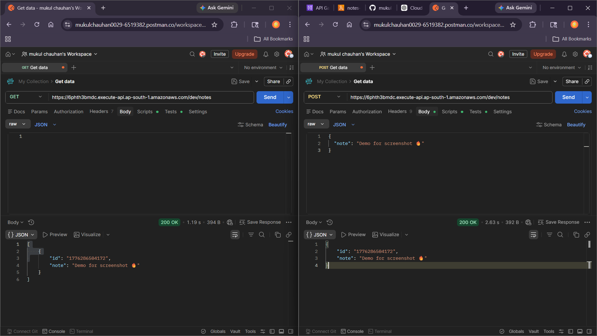

# 🚀 Notes App (Full Stack Cloud Project)

A full-stack Notes application built using AWS Serverless architecture and modern frontend technologies.

---

## 🌍 Live Demo
👉 https://aws-notes-api.vercel.app/

---

## 🛠 Tech Stack

### Frontend
- React (Vite)
- Tailwind CSS
- JavaScript

### Backend
- AWS Lambda
- API Gateway

### Database
- DynamoDB

---

## ✨ Features
- Add Notes
- View Notes
- Delete Notes
- Real-time updates
- Responsive UI (Glassmorphism design)

---

## 📸 Screenshots

---

## ⚡ How it works
Frontend (React) → API Gateway → AWS Lambda → DynamoDB

---

## 🧠 What I learned
- Serverless architecture (AWS)
- API integration with frontend
- CORS handling
- Deployment using Vercel
- UI design using Tailwind CSS

---

## 👨‍💻 Author
Mukul Kumar